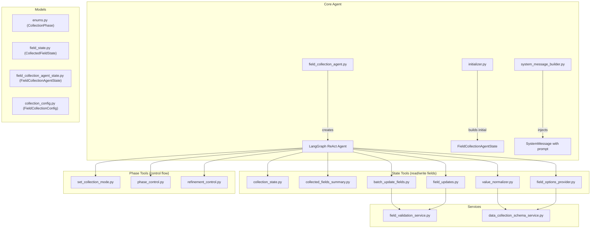
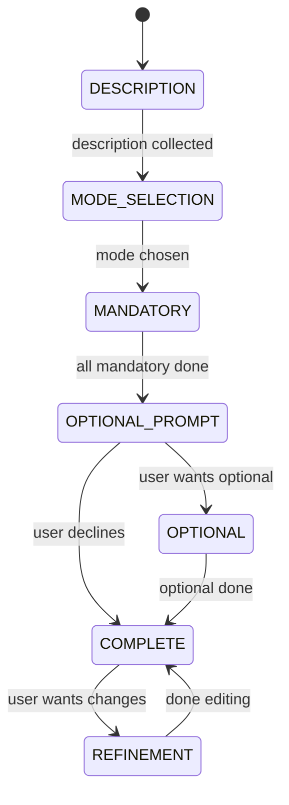

# Field Collection Agent — Complete Walkthrough

## What Is It?

The **Field Collection Agent** is a LangGraph **ReAct agent** that conducts a multi-turn conversation with a user to gather product-search preferences (description, vendor, price, currency, billing cycle, etc.) before handing off to a Retrieval Agent that finds matching products. It is the **first half** of the PDA chatbot pipeline.

---

## Architecture Overview



---

## Phase State Machine

The agent moves through a strict sequence of phases, tracked by the [CollectionPhase](file:///home/vaishali/PDA_backend_pahse2_new/AI-ITTRackNap/src/models/enums.py#5-23) enum:



| Phase | Meaning |
|---|---|
| `DESCRIPTION` | Waiting for the user to describe what product they need |
| `MODE_SELECTION` | Asking the user: bulk or conversational? |
| `MANDATORY` | Collecting required fields one-by-one or in bulk |
| `OPTIONAL_PROMPT` | Asking "do you want to provide optional info?" |
| `OPTIONAL` | Collecting optional fields |
| `COMPLETE` | All done — triggers the retrieval agent |
| `REFINEMENT` | User came back to edit preferences after seeing results |

---

## File-by-File Breakdown

### 1. Core Files

---

#### [field_collection_agent.py](file:///home/vaishali/PDA_backend_pahse2_new/AI-ITTRackNap/src/agents/field_collection/field_collection_agent.py)

**Purpose**: Factory function that assembles and returns the agent.

- Calls `GlobalDependencyContainer.get_llm()` to get the configured LLM (OpenAI / Bedrock).
- Registers **12 tools** split into two groups:
  - **State tools** (6): [get_collection_state](file:///home/vaishali/PDA_backend_pahse2_new/AI-ITTRackNap/src/agents/field_collection/tools/collection_state.py#7-45), [get_collected_fields_summary](file:///home/vaishali/PDA_backend_pahse2_new/AI-ITTRackNap/src/agents/field_collection/tools/collected_fields_summary.py#7-48), [update_field_value](file:///home/vaishali/PDA_backend_pahse2_new/AI-ITTRackNap/src/agents/field_collection/tools/field_updates.py#11-75), [batch_update_fields](file:///home/vaishali/PDA_backend_pahse2_new/AI-ITTRackNap/src/agents/field_collection/tools/batch_update_fields.py#53-202), [normalize_field_value](file:///home/vaishali/PDA_backend_pahse2_new/AI-ITTRackNap/src/agents/field_collection/tools/value_normalizer.py#13-144), [get_field_options](file:///home/vaishali/PDA_backend_pahse2_new/AI-ITTRackNap/src/agents/field_collection/tools/field_options_provider.py#12-49)
  - **Phase tools** (6): [set_collection_mode](file:///home/vaishali/PDA_backend_pahse2_new/AI-ITTRackNap/src/agents/field_collection/tools/set_collection_mode.py#7-48), [set_optional_preference](file:///home/vaishali/PDA_backend_pahse2_new/AI-ITTRackNap/src/agents/field_collection/tools/phase_control.py#9-37), [update_collection_phase](file:///home/vaishali/PDA_backend_pahse2_new/AI-ITTRackNap/src/agents/field_collection/tools/phase_control.py#39-115), [mark_collection_complete](file:///home/vaishali/PDA_backend_pahse2_new/AI-ITTRackNap/src/agents/field_collection/tools/phase_control.py#118-145), [enter_refinement_mode](file:///home/vaishali/PDA_backend_pahse2_new/AI-ITTRackNap/src/agents/field_collection/tools/refinement_control.py#10-45), [exit_refinement_mode](file:///home/vaishali/PDA_backend_pahse2_new/AI-ITTRackNap/src/agents/field_collection/tools/refinement_control.py#47-74)
- Returns a `create_react_agent(llm, tools)` — a standard LangGraph ReAct loop.

---

#### [initializer.py](file:///home/vaishali/PDA_backend_pahse2_new/AI-ITTRackNap/src/agents/field_collection/initializer.py)

**Purpose**: Creates the initial [FieldCollectionAgentState](file:///home/vaishali/PDA_backend_pahse2_new/AI-ITTRackNap/src/models/field_collection_agent_state.py#13-24) dict for a new session.

Key logic:
1. Reads the [FieldCollectionConfig](file:///home/vaishali/PDA_backend_pahse2_new/AI-ITTRackNap/src/models/collection_config.py#10-23) (mandatory & optional field lists + descriptions).
2. Builds a [CollectedFieldState](file:///home/vaishali/PDA_backend_pahse2_new/AI-ITTRackNap/src/models/field_state.py#6-12) entry for every field:
   - [description](file:///home/vaishali/PDA_backend_pahse2_new/AI-ITTRackNap/src/services/data_collection_schema_service.py#54-75) is always present and marked `required_to_ask=True`.
   - Mandatory fields → `required_to_ask=True`.
   - Optional fields → `required_to_ask=False`.
3. Initialises the state dict with:
   - `phase = DESCRIPTION` (starting phase)
   - `collection_mode = None`
   - `is_collection_complete = False`
   - Empty `collected_data` and `messages`

---

#### [system_message_builder.py](file:///home/vaishali/PDA_backend_pahse2_new/AI-ITTRackNap/src/agents/field_collection/system_message_builder.py)

**Purpose**: Builds a `SystemMessage` that is injected at the start of every LLM call, carrying up-to-date state.

Template variables injected into the prompt:
| Variable | Source |
|---|---|
| `session_id` | State dict |
| `description_question` | From the "description" field definition |
| `mandatory_fields` | Comma-separated list of mandatory field names |
| `optional_fields` | Comma-separated list of optional field names |
| `current_phase` | e.g. `"mandatory"` |
| [collected_fields](file:///home/vaishali/PDA_backend_pahse2_new/AI-ITTRackNap/src/agents/field_collection/tools/collected_fields_summary.py#7-48) | Key-value pairs of everything collected so far |
| `remaining_fields` | Fields not yet collected |
| [collection_mode](file:///home/vaishali/PDA_backend_pahse2_new/AI-ITTRackNap/src/agents/field_collection/tools/set_collection_mode.py#7-48) | `"bulk"`, `"conversational"`, or `"not_set"` |
| `all_fields_info` | Every field name + description (used in bulk mode to show the user) |
| `duration_validation_info` | Valid ranges for billing_cycle / subscription_period (from Qdrant) |
| `available_categories` | Product category labels for suggesting to users with vague descriptions |

---

### 2. Tool Files (State Tools)

---

#### [collection_state.py](file:///home/vaishali/PDA_backend_pahse2_new/AI-ITTRackNap/src/agents/field_collection/tools/collection_state.py)

**Purpose**: Read-only snapshot of the entire collection state.

Returns:
- [phase](file:///home/vaishali/PDA_backend_pahse2_new/AI-ITTRackNap/src/agents/field_collection/tools/phase_control.py#39-115), `is_collection_complete`
- [collected_fields](file:///home/vaishali/PDA_backend_pahse2_new/AI-ITTRackNap/src/agents/field_collection/tools/collected_fields_summary.py#7-48) (list of field names already stored)
- `pending_mandatory` / `pending_optional` (fields still needed)
- `user_wants_optional`, `description_collected`

The LLM calls this to decide what to ask/do next.

---

#### [collected_fields_summary.py](file:///home/vaishali/PDA_backend_pahse2_new/AI-ITTRackNap/src/agents/field_collection/tools/collected_fields_summary.py)

**Purpose**: Returns collected data as **key-value pairs** (not just field names).

Used when the user asks "what have you collected so far?" or when switching modes, so the agent can display actual values (e.g., `description: CRM tool, vendor: Microsoft`).

---

#### [field_updates.py](file:///home/vaishali/PDA_backend_pahse2_new/AI-ITTRackNap/src/agents/field_collection/tools/field_updates.py) — [update_field_value](file:///home/vaishali/PDA_backend_pahse2_new/AI-ITTRackNap/src/agents/field_collection/tools/field_updates.py#11-75)

**Purpose**: Update **a single field** at a time (used in conversational mode).

Key behaviour:
1. **Guards**: Blocks updates if phase is `COMPLETE` (must enter refinement first).
2. **Validation**: Rejects null descriptions; validates duration fields against allowed Qdrant ranges.
3. **Bare-number detection**: If user gives just `"1"` for billing_cycle, returns an error asking "1 Month or 1 Year?".
4. Updates both `collected_data` dict and marks `field.collected = True`.
5. Returns `recommendation_note` if the duration is valid but not an exact catalog match.

---

#### [batch_update_fields.py](file:///home/vaishali/PDA_backend_pahse2_new/AI-ITTRackNap/src/agents/field_collection/tools/batch_update_fields.py) — [batch_update_fields](file:///home/vaishali/PDA_backend_pahse2_new/AI-ITTRackNap/src/agents/field_collection/tools/batch_update_fields.py#53-202)

**Purpose**: Update **multiple fields at once** (used in bulk mode, or when user mentions several preferences in one message).

Key behaviour:
1. Same `COMPLETE` phase guard as [update_field_value](file:///home/vaishali/PDA_backend_pahse2_new/AI-ITTRackNap/src/agents/field_collection/tools/field_updates.py#11-75).
2. For each field in the input dict:
   - **`vendor` / `currency`** → calls [normalize_field_value](file:///home/vaishali/PDA_backend_pahse2_new/AI-ITTRackNap/src/agents/field_collection/tools/value_normalizer.py#13-144) (fuzzy + LLM).
   - **`billing_cycle` / `subscription_period`** → applies lightweight synonym mapping (`DURATION_SYNONYMS` dict) + range validation. No LLM call.
   - **All other fields** → stored as-is.
3. Bare numbers like `"1"` for duration fields are rejected with a "Month or Year?" prompt.
4. Returns: `updated_fields`, `failed_fields`, `normalized_values`, and `recommendation_notes`.

> [!NOTE]
> The `DURATION_SYNONYMS` dict maps natural language like `"monthly"` → `"1 Month"`, `"quarterly"` → `"3 Months"`, `"annual"` → `"1 Year"`, etc.

---

#### [value_normalizer.py](file:///home/vaishali/PDA_backend_pahse2_new/AI-ITTRackNap/src/agents/field_collection/tools/value_normalizer.py) — [normalize_field_value](file:///home/vaishali/PDA_backend_pahse2_new/AI-ITTRackNap/src/agents/field_collection/tools/value_normalizer.py#13-144)

**Purpose**: Normalizes free-text user input to one of the allowed values for a field (primarily `vendor` and `currency`).

Three-tier matching strategy:
1. **Exact match** (case-insensitive) — cheapest.
2. **Fuzzy match** via `difflib.get_close_matches` with cutoff 0.85 — handles typos.
3. **LLM fallback** — sends the allowed values to the LLM and asks it to pick the best match.

If none of the three tiers match, returns `None` (the agent then tells the user "this vendor/currency is not supported").

Token usage from the LLM fallback is tracked via `GlobalDependencyContainer.get_tracker()`.

---

#### [field_options_provider.py](file:///home/vaishali/PDA_backend_pahse2_new/AI-ITTRackNap/src/agents/field_collection/tools/field_options_provider.py) — [get_field_options](file:///home/vaishali/PDA_backend_pahse2_new/AI-ITTRackNap/src/agents/field_collection/tools/field_options_provider.py#12-49)

**Purpose**: When the user asks "what vendors do you support?" or "what currencies are available?", this tool returns the allowed values for any field by reading from `fields_information.json` via `data_collection_schema_service`.

Returns: `field_name`, [description](file:///home/vaishali/PDA_backend_pahse2_new/AI-ITTRackNap/src/services/data_collection_schema_service.py#54-75), [allowed_values](file:///home/vaishali/PDA_backend_pahse2_new/AI-ITTRackNap/src/services/data_collection_schema_service.py#31-52), `has_restrictions`.

---

### 3. Tool Files (Phase Tools)

---

#### [set_collection_mode.py](file:///home/vaishali/PDA_backend_pahse2_new/AI-ITTRackNap/src/agents/field_collection/tools/set_collection_mode.py) — [set_collection_mode](file:///home/vaishali/PDA_backend_pahse2_new/AI-ITTRackNap/src/agents/field_collection/tools/set_collection_mode.py#7-48)

**Purpose**: Sets the user's preferred collection mode to either `"bulk"` or `"conversational"`.

- Validates input is one of the two modes.
- Stores the mode in `state["collection_mode"]`.
- If currently in `MODE_SELECTION` phase, auto-advances to `MANDATORY`.

---

#### [phase_control.py](file:///home/vaishali/PDA_backend_pahse2_new/AI-ITTRackNap/src/agents/field_collection/tools/phase_control.py)

Contains **3 tools**:

| Tool | Purpose |
|---|---|
| [set_optional_preference(wants_optional)](file:///home/vaishali/PDA_backend_pahse2_new/AI-ITTRackNap/src/agents/field_collection/tools/phase_control.py#9-37) | Records user's answer to "do you want optional fields?". If yes → phase becomes `OPTIONAL`. If no → phase becomes `COMPLETE` and `is_collection_complete = True`. |
| [update_collection_phase()](file:///home/vaishali/PDA_backend_pahse2_new/AI-ITTRackNap/src/agents/field_collection/tools/phase_control.py#39-115) | Advances the phase based on current data: `DESCRIPTION→MODE_SELECTION`, `MODE_SELECTION→MANDATORY`, `MANDATORY→OPTIONAL_PROMPT`, `OPTIONAL→COMPLETE`. Blocks during `REFINEMENT`. |
| [mark_collection_complete()](file:///home/vaishali/PDA_backend_pahse2_new/AI-ITTRackNap/src/agents/field_collection/tools/phase_control.py#118-145) | Explicitly sets `phase = COMPLETE` and `is_collection_complete = True`. This triggers the outer orchestrator to hand off to the Retrieval Agent. |

---

#### [refinement_control.py](file:///home/vaishali/PDA_backend_pahse2_new/AI-ITTRackNap/src/agents/field_collection/tools/refinement_control.py)

Contains **2 tools**:

| Tool | Purpose |
|---|---|
| [enter_refinement_mode()](file:///home/vaishali/PDA_backend_pahse2_new/AI-ITTRackNap/src/agents/field_collection/tools/refinement_control.py#10-45) | Transitions from `COMPLETE` → `REFINEMENT`. Deletes the old cached recommendation from Redis so the frontend doesn't show stale data. Sets `is_collection_complete = False`. |
| [exit_refinement_mode()](file:///home/vaishali/PDA_backend_pahse2_new/AI-ITTRackNap/src/agents/field_collection/tools/refinement_control.py#47-74) | Transitions from `REFINEMENT` → `COMPLETE`. Sets `is_collection_complete = True` and increments `recommendation_count`. This triggers a **new** retrieval with updated preferences. |

---

### 4. Models

---

#### [enums.py](file:///home/vaishali/PDA_backend_pahse2_new/AI-ITTRackNap/src/models/enums.py) — [CollectionPhase](file:///home/vaishali/PDA_backend_pahse2_new/AI-ITTRackNap/src/models/enums.py#5-23)

A `str, Enum` with 8 values: `MODE_SELECTION`, `DESCRIPTION`, `MANDATORY`, `OPTIONAL_PROMPT`, `OPTIONAL`, `COMPLETE`, `REFINEMENT`, `ERROR`. Has a [from_value()](file:///home/vaishali/PDA_backend_pahse2_new/AI-ITTRackNap/src/models/enums.py#15-23) classmethod for safe deserialization.

---

#### [field_state.py](file:///home/vaishali/PDA_backend_pahse2_new/AI-ITTRackNap/src/models/field_state.py) — [CollectedFieldState](file:///home/vaishali/PDA_backend_pahse2_new/AI-ITTRackNap/src/models/field_state.py#6-12)

Pydantic model for a single field's metadata:
- `name`, [description](file:///home/vaishali/PDA_backend_pahse2_new/AI-ITTRackNap/src/services/data_collection_schema_service.py#54-75), `required_to_ask` (mandatory vs optional)
- `collected: bool` — whether user provided a value
- `value: Optional[Any]` — the stored value

---

#### [field_collection_agent_state.py](file:///home/vaishali/PDA_backend_pahse2_new/AI-ITTRackNap/src/models/field_collection_agent_state.py) — [FieldCollectionAgentState](file:///home/vaishali/PDA_backend_pahse2_new/AI-ITTRackNap/src/models/field_collection_agent_state.py#13-24)

TypedDict that is the **single source of truth** during a session:

| Key | Type | Purpose |
|---|---|---|
| `session_id` | `str` | Unique session identifier |
| `messages` | `List[MessageDict]` | Conversation history |
| [fields](file:///home/vaishali/PDA_backend_pahse2_new/AI-ITTRackNap/src/agents/field_collection/tools/batch_update_fields.py#53-202) | `Dict[str, CollectedFieldState]` | Metadata for every field |
| `collected_data` | `Dict[str, Any]` | Canonical key-value store of user answers |
| [phase](file:///home/vaishali/PDA_backend_pahse2_new/AI-ITTRackNap/src/agents/field_collection/tools/phase_control.py#39-115) | [CollectionPhase](file:///home/vaishali/PDA_backend_pahse2_new/AI-ITTRackNap/src/models/enums.py#5-23) | Current phase |
| [collection_mode](file:///home/vaishali/PDA_backend_pahse2_new/AI-ITTRackNap/src/agents/field_collection/tools/set_collection_mode.py#7-48) | `Optional[str]` | `"bulk"` / `"conversational"` / `None` |
| `user_wants_optional` | `Optional[bool]` | User's answer to the optional prompt |
| `is_collection_complete` | `bool` | Trigger flag for retrieval |
| `next_action` | `Optional[str]` | Hint for orchestrator |
| `data_collection_schema` | [FieldCollectionConfig](file:///home/vaishali/PDA_backend_pahse2_new/AI-ITTRackNap/src/models/collection_config.py#10-23) | The schema defining which fields exist |

---

#### [collection_config.py](file:///home/vaishali/PDA_backend_pahse2_new/AI-ITTRackNap/src/models/collection_config.py)

Defines the schema config:
- [FieldDefinition](file:///home/vaishali/PDA_backend_pahse2_new/AI-ITTRackNap/src/models/collection_config.py#5-9): `field_name`, [field_description](file:///home/vaishali/PDA_backend_pahse2_new/AI-ITTRackNap/src/services/data_collection_schema_service.py#54-75), optional [allowed_values](file:///home/vaishali/PDA_backend_pahse2_new/AI-ITTRackNap/src/services/data_collection_schema_service.py#31-52)
- [FieldCollectionConfig](file:///home/vaishali/PDA_backend_pahse2_new/AI-ITTRackNap/src/models/collection_config.py#10-23): lists of `mandatory` field names, [optional](file:///home/vaishali/PDA_backend_pahse2_new/AI-ITTRackNap/src/agents/field_collection/tools/phase_control.py#9-37) field names, and [field_descriptions](file:///home/vaishali/PDA_backend_pahse2_new/AI-ITTRackNap/src/services/data_collection_schema_service.py#12-29)

This is built dynamically per partner via `CollectionSchemaProvider.build_schema()`.

---

### 5. Services

---

#### [data_collection_schema_service.py](file:///home/vaishali/PDA_backend_pahse2_new/AI-ITTRackNap/src/services/data_collection_schema_service.py)

- [load_field_descriptions()](file:///home/vaishali/PDA_backend_pahse2_new/AI-ITTRackNap/src/services/data_collection_schema_service.py#12-29) — LRU-cached loader for `fields_information.json` (the static field definitions).
- [get_field_allowed_values(field_name)](file:///home/vaishali/PDA_backend_pahse2_new/AI-ITTRackNap/src/services/data_collection_schema_service.py#31-52) / [get_field_description(field_name)](file:///home/vaishali/PDA_backend_pahse2_new/AI-ITTRackNap/src/services/data_collection_schema_service.py#54-75) — lookup helpers.
- [CollectionSchemaProvider](file:///home/vaishali/PDA_backend_pahse2_new/AI-ITTRackNap/src/services/data_collection_schema_service.py#77-97) — fetches partner-specific configurable fields from the Admin API and builds a [FieldCollectionConfig](file:///home/vaishali/PDA_backend_pahse2_new/AI-ITTRackNap/src/models/collection_config.py#10-23).

---

#### [field_validation_service.py](file:///home/vaishali/PDA_backend_pahse2_new/AI-ITTRackNap/src/services/field_validation_service.py)

Validates duration fields (`billing_cycle`, `subscription_period`) against **real product data in Qdrant**:

1. Scrolls through the Qdrant SKU collection to extract all distinct duration values from nested `pricing_details`.
2. Parses them to month counts and computes min/max ranges.
3. Caches the result for 1 hour.
4. Falls back to static `fields_information.json` if Qdrant is unavailable.

Key functions:
- [validate_duration_value(field, value)](file:///home/vaishali/PDA_backend_pahse2_new/AI-ITTRackNap/src/services/field_validation_service.py#243-300) → [(is_valid, message)](file:///home/vaishali/PDA_backend_pahse2_new/AI-ITTRackNap/src/services/data_collection_schema_service.py#78-85) — rejects out-of-range durations, returns recommendation notes for non-exact matches.
- [get_duration_validation_context()](file:///home/vaishali/PDA_backend_pahse2_new/AI-ITTRackNap/src/services/field_validation_service.py#302-323) → string injected into the system prompt so the LLM knows valid ranges.

---

### 6. System Prompt

#### [input_collection_agent_system_prompt.py](file:///home/vaishali/PDA_backend_pahse2_new/AI-ITTRackNap/src/prompts/input_collection_agent_system_prompt.py)

A ~415-line prompt that governs the agent's entire behaviour. Key sections:

| Section | What it controls |
|---|---|
| **Priority Order** | Description → Mode Selection → Field Collection (strict sequence) |
| **STEP-1: Description** | Rules for accepting/rejecting descriptions, extraction guards (don't extract vendor from product names), vague description detection with category suggestions |
| **STEP-2: Mode Selection** | Present bulk vs conversational, handle edge cases where user ignores the question |
| **Bulk Mode** | Show all fields at once, use [batch_update_fields](file:///home/vaishali/PDA_backend_pahse2_new/AI-ITTRackNap/src/agents/field_collection/tools/batch_update_fields.py#53-202), keep asking until user says "proceed" |
| **Conversational Mode** | Ask fields one-by-one, mandatory first, then optional prompt, use [update_field_value](file:///home/vaishali/PDA_backend_pahse2_new/AI-ITTRackNap/src/agents/field_collection/tools/field_updates.py#11-75) |
| **Mode Switching** | Handle "switch to bulk/conversational" mid-conversation without losing collected data |
| **Field Rules** | Price = max numeric value, currency symbol extraction, duration disambiguation |
| **Normalization Rules** | When to call [normalize_field_value](file:///home/vaishali/PDA_backend_pahse2_new/AI-ITTRackNap/src/agents/field_collection/tools/value_normalizer.py#13-144) (vendor, currency) vs synonym mapping (durations) |
| **Duration Validation** | Accept any duration in range, show recommendations for non-exact matches |
| **Refinement Mode** | Enter/exit refinement, update preferences, trigger new retrieval |

---

## End-to-End Flow

```
1. Session created → initializer.py builds FieldCollectionAgentState
2. First user message arrives
3. system_message_builder.py injects SystemMessage with current state
4. LLM (ReAct loop) calls tools:
   a. Asks for description → update_field_value("description", ...)
   b. Asks for mode → set_collection_mode("bulk" | "conversational")
   c. Collects fields:
      - Conversational: update_field_value() one at a time
      - Bulk: batch_update_fields({...}) with multiple fields
      - vendor/currency values go through normalize_field_value first
      - duration values validated against Qdrant ranges
   d. Asks about optional fields → set_optional_preference()
   e. mark_collection_complete() → sets is_collection_complete = True
5. Outer orchestrator detects is_collection_complete → hands off to Retrieval Agent
6. If user wants changes → enter_refinement_mode → edit → exit_refinement_mode → new retrieval
```
